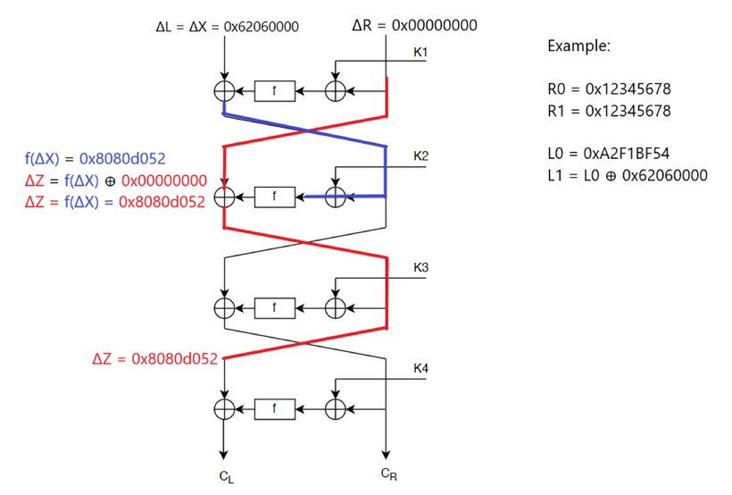
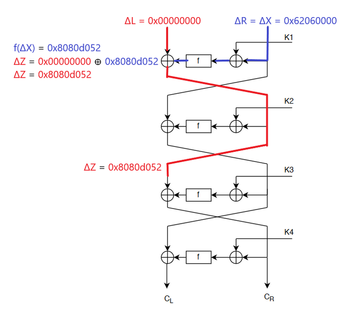

# Differential Cryptanalysis

This repository contains the code and corresponding report for an attack on a WES (4-round feistel) cypher. The purpose is to retrieve the master encryption key using differential cryptanalysis.


## Scenario

An authentication system uses a smart card and a reader. In order to authenticate, the card and the reader share the same encryption key and implement a simple authentication protocol: when the card is close to the reader, the reader generates a random number and sends it to the card. The card encrypts this number with the shared key and sends the result back. The reader then decrypts this ciphertext, and if the result equals the previously generated number, this proves that the card knows the key and thus the reader authenticates the card.

## Given

To simulate the smart card, we are given a compiled binary program, wes-key-53, that implements WES cipher. We also have the code for the wes implementation.

```
Usage:   ./wes-key-53 PLAINTEXT_HEX

Example: ./wes-key-53 72657475706D6F43
```
Result
```
5C15BF64490B5E20
```

Since the WES specification is public, we also have access to the general structure of the cypher. We can use this to plan our attack.

Cypher Structure


## Attack

The master key is 64 bits long meaning if we were to try to brute force it, we would have to try 2^64 = 18,446,744,073,709,551,616 possibilities. That sounds long and torturous so instead we are going to exploit vulnerabilities in the cypher to get the master key. 

The plan of attack is to break the cypher backwards. In other words, we need to break K4, then K3, then K2, and then K1. The master key is used to create the subkeys (K1-K4). They are created in the following way as specified by WES:

* K4 - The right half of the master key (32 bits)
* K3 - The even bits in the master key (32 bits)
* K2 - The left half of the master key (32 bits)
* K1 - The odd bits of the master key (32 bits)

### Setup

In order to begin breaking the cypher, we need to analyze the round function. The round function's purpose is to mix up the input it's given. The round function takes in 32 bits. It then passes those bits through 8 s-boxes. Each s-box takes in 4 bits (a hex digit) and has a certain probability of outputting another 4 bits. 

Ex: 1 -> s-box1 -> B with probability 0.25


The reason that it isn't guaranteed is because the cypher was designed in an effort to stop attackers even if they know its specification. Something important to note is that, for all eight s-boxes, an input of 0 results in an output of 0.

### Analyzing s-boxes

We analyze the s-boxes by creating difference distrubution tables. The entry in each cell will always be an even number. The reason for this is the xor operation is symmetric, meaning

`ΔX = X1 ⊕ X2 = AC ⊕ DF = 73`

`ΔX = X1 ⊕ X2 = DF ⊕ AC = 73`


Here is the table from the first s-box to demonstrate its shape:


Let's analyze the s-boxes to see if there are any other input/output pairs that have 100% probability besides (0, 0).

* s-box1 - (6, D)
* s-box2 - (2, 5)
* s-box3 - (6, D)

Nice, we have 3 input/output pairs that are non zero. We can abuse these to track the propagation of our input through the cypher. 

## Breaking K4
This is where things get a bit technical so bear with me.

The tactic for breaking the fourth round of encryption is to use sets of plaintext pairs that have a specific result (differential) when XORed together. The cipher takes in two 8 byte hexadecimal numbers, L0 (the left 8) and R0 (the right 8), to form a 16 byte hexadecimal input. We will construct two plaintext inputs at the same time, they will be In1 = L0R0 and In2 = L1R1. We will choose L0 and L1 such that 

`L0 = L1`

`ΔL = L0 ⊕ (L1 ⊕ 0x62060000) = 0x62060000 = ΔX`

What is 0x62060000 you may be asking? That is a differential that has a guaranteed output when passed through the s-boxes! Notice that the first hex-digit (four bits going into s-box1) is 6, which has a guaranteed output of D as per our s-box analysis. The second digit, 2, which has a guaranteed output of 5 in the second s-box, and finally the fourth digit, 6, that has a guaranteed output of D when passed through the fourth s-box. The rest are all 0s since we didn't get any guaranteed input output pairs for those s-boxes. 

Then we will choose R0 and R1

`R0 = R1` so that `ΔR = R0 ⊕ R1 = 0x00000000`

Well why do we want R0 and R1 to be the same? Because, in the first round of encryption, the right 8 bytes get XORed with K1:


`R0` becomes `R0 ⊕ K1`

and `R1` becomes `R1 ⊕ K1`

we don't know what `K1` is so we can't know the outcome of this operation, however the differential `ΔR` is

`ΔR = (R0 ⊕ K1) ⊕ (R1 ⊕ K1)`

however since we know that `R0` and `R1` are the same, we know that the outcome of the above is going to be

`ΔR = 0x00000000`

Knowing that, we can track the right side as it flows through the cipher. Here is a diagram to visualize it.



First round: 

- Right side output:
  - `ΔR = 0x00000000`
- Left side output:
  - After the xor with K1 (nullified by our choice of plaintext pairs) we enter the round function. Going in, `ΔR` is 0 and we know from before that the s-boxes have a probability of 1 to output 0 when given 0 so the output of the round function is `0x00000000`. Next, that gets XORed with `ΔL` which I also refer to as `ΔX` since it is our input with a guaranteed output. `ΔL ⊕ 0x00000000 = ΔL` so the output is simply `ΔL`. Just for clarity once again, `ΔL = ΔX`. It's just a naming convention.

Second round:
- Right side output:
  - The input to the right side of round 2 is `ΔL`. Once again, the XOR with K2 is nullfied by our choice of plaintext pairs. We know that `f(ΔX)` is guranteed to be the same every time. So we can just compute it once to determine its value (it isn't simply 0xD50D0000 because there is also the permutation step in the round function but that is constant and known from the WES specification)
  - `f(ΔX) = 0x8080d052`
  - `ΔZ = f(ΔX) ⊕ 0x00000000 = f(ΔX) = 0x8080d052`
- Left side output:
  - Once again nothing happens on the right side so the output is just `ΔL` which doesn't matter as we do not need it to crack K4.

Third round:
- Nothing we need to do, as you will see in the next paragraph.

**Fourth Round**

The point of everything we have done so far was to find out what the value is going into the left side of the last round of encryption. Why? Because, now we have everything we need to crack K4. 

We have the ciphertext `CL` and `CR` already! There is nothing stopping us from encrypting our plaintext to determine the corresponding ciphertext!

We can write `CL` in the following way:

`CL = ΔZ ⊕ f(CR ⊕ K4)`

Now all we have to do is test every possible `K4` and collect all `K4`s that produce `CL` (it is possible that there are more than 1). Testing every possible K4 may sound like a lot as there are 2^32 = 4,294,967,296 possibilities, but it really isn't. With a couple of threads on an 8 core cpu and compiler optimization we can find all the candidate keys in 30 seconds or less. We end up with 32 candidate keys for K4 (could vary depending on the master key). 


## Breaking K3

The general tactic to break round 3 is similar to the tactic used to break round 4 in that we will choose plaintext pairs that we can use to exploit the s-boxes and track propagation through the cipher. There are two main differences this time.

1. We want the `ΔZ` going into the left side of the third round of encryption instead of the fourth.
2. To do this, we make `ΔL = 0x00000000` and `ΔR = ΔX = 0x62060000` (reverse of what we did to crack K4)

There is one other thing that is going to aid us in cracking `K3`. That is the fact that `K4` is the right half of the master key and `K3` is all the even bits of the master key. Meaning we already have some of the bits of `K3` (we actually have 32 possibilities for some of the bits of `K3` but you get the point). Since `K4` is 32 bits, and half of those are the even bits from the master key, we have a total of 16 bits, the last half of `K3`. Instead of testing 2^32 possible `K3`s we only have to test (2^16) * 32 (32 `K4` candidates). That's only 2,097,152 possibilities which is nothing.

I won't bother repeating all the logic again for the beginning as it is largely the same as for K4. However, there is a slight difference in the strategy for cracking K3. We need to use our K4 candidate keys to partially decrypt the ciphertext. In other words, we have to undo the last round of encryption so we can get the `CL` and `CR` just after the third round of encryption.

Left side output of round 3:
- `CL-K3 = CR` where CR is the right side output of the whole cipher

Right side output of round 3:
- `CR-K3 = CL ⊕ (f(CR) ⊕ K4)` - undo the fourth round of encryption using the K4 candidate, where CR is the right side output of the whole cipher and CL is the output left side output of the whole cipher

Finally, the formula for cracking K3 is the same as for cracking K4:
- `CL-K3 = ΔZ ⊕ f(CR-K3 ⊕ K3)` - where the last half of `K3` is all the even bits from a `K4` candidate.




After brute forcing, we end up with 16 candidate keys for K3 and have narrowed K4 down to one key. In other words, we cracked K4.

## Breaking K2

