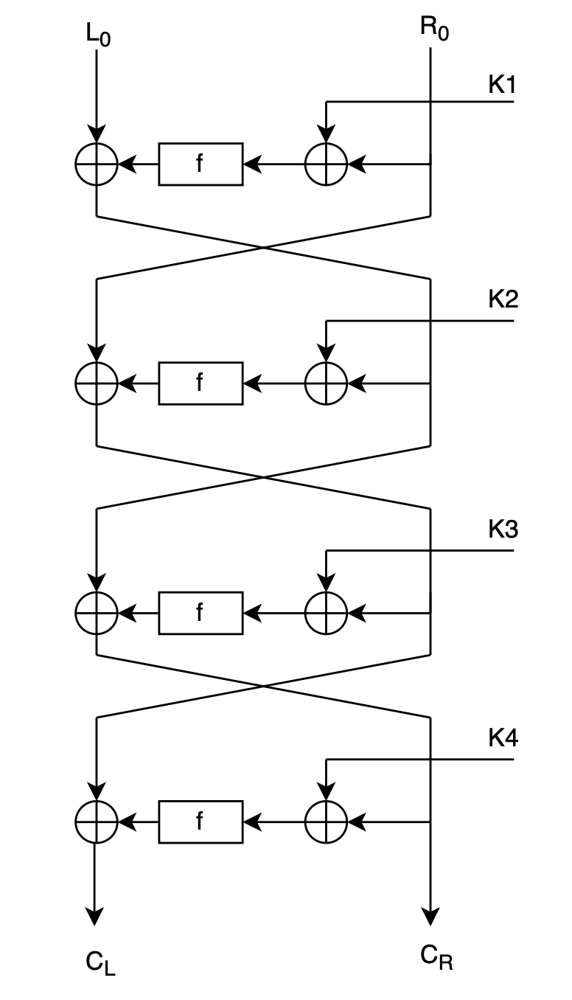
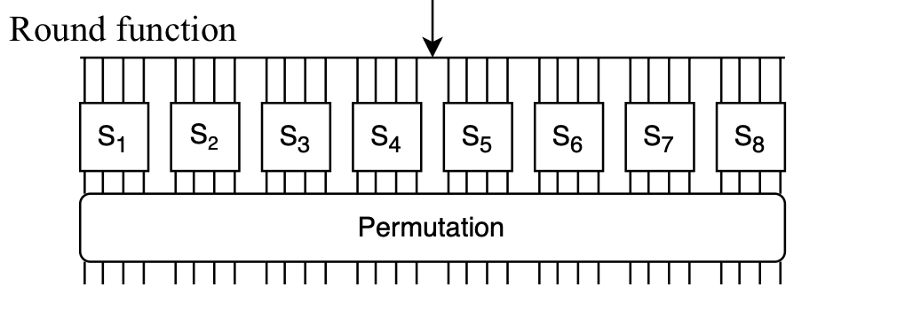

# Differential Cryptanalysis

This repository contains the code and corresponding report for an attack on a WES (4-round feistel) cypher. The purpose is to retrieve the master encryption key using differential cryptanalysis.


## Scenario

An authentication system uses a smart card and a reader. In order to authenticate, the card and the reader share the same encryption key and implement a simple authentication protocol: when the card is close to the reader, the reader generates a random number and sends it to the card. The card encrypts this number with the shared key and sends the result back. The reader then decrypts this ciphertext, and if the result equals the previously generated number, this proves that the card knows the key and thus the reader authenticates the card.

## Given

To simulate the smart card, we are given a compiled binary program, wes-key-53, that implements WES cipher. 

```
Usage:   ./wes-key-53 PLAINTEXT_HEX

Example: ./wes-key-53 72657475706D6F43
```
Result
```
5C15BF64490B5E20
```

Since the WES specification is public, we also have access to the general structure of the cypher. We can use this to plan our attack.

Cypher Structure




## Attack

The master key is 64 bits long meaning if we were to try to brute force it, we would have to try 2^64 = 18,446,744,073,709,551,616 possibilities. That sounds long and torturous so instead we are going to exploit vulnerabilities in the cypher to get the master key. 

The plan of attack is to break the cypher backwards. In other words, we need to break K4, then K3, then K2, and then K1. The master key is used to create the subkeys (K1-K4). They are created in the following way as specified by WES:

* K4 - The right half of the master key (32 bits)
* K3 - The even bits in the master key (32 bits)
* K2 - The left half of the master key (32 bits)
* K1 - The odd bits of the master key (32 bits)

### Setup

In order to begin breaking the cypher, we need to analyze the round function. The round function's purpose is to mix up the input it's given. The round function takes in 32 bits. It then passes those bits through 8 sboxs. Each sbox takes in 4 bits (a hex digit) and has a certain probability of outputting another 4 bits. 

Ex: 1 -> sbox1 -> B with probability 0.25



The reason that it isn't guaranteed is because the cypher was designed in an effort to stop attackers even if they know its specification. Something important to note is that, for all eight sboxs, an input of 0 results in an output of 0. 

### Analyzing Sboxs

Let's analyze the sboxs to see if there are any other input/output pairs that have 100% probability besides (0, 0).

* Sbox1 - (6, D)
* Sbox2 - (2, 5)
* Sbox3 - (6, D)


### Breaking K4

